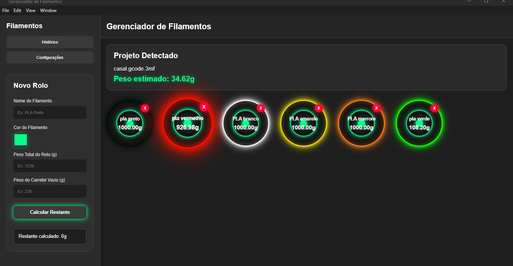

# Gerenciador-de-filamentos-na-sobra
Gerenciador de filamentos, que calcula a quantidade em gramas restante no carretel de 1 kilo
# Gerenciador de Filamentos na Sobra

Software desktop desenvolvido em Electron para ajudar usuários de impressão 3D a controlar automaticamente a quantidade restante de filamento em rolos parcialmente usados.

## Objetivo

O projeto foi criado para resolver um problema comum no uso do Bambu Studio:

* saber exatamente quantos gramas ainda restam em um rolo;
* evitar iniciar impressões sem filamento suficiente;
* acompanhar automaticamente o consumo real dos projetos `.3mf`.

O software monitora uma pasta local e lê automaticamente o peso estimado do filamento diretamente do G-code contido nos arquivos `.3mf`.

---

## Recursos

* Cadastro manual de rolos de filamento;
* Controle do peso restante;
* Seleção de rolo ativo;
* Histórico automático de arquivos `.3mf`;
* Leitura automática do peso de filamento do projeto;
* Atualização automática do restante do rolo;
* Alertas de:

  * filamento insuficiente;
  * abaixo de 20%;
  * abaixo de 10%;
  * rolo vazio;
* Avisos sonoros por voz;
* Interface neon estilizada;
* Funcionamento offline.

---

## Tecnologias utilizadas

* Electron
* JavaScript
* Node.js
* Chokidar
* Adm-Zip

---

## Como funciona

O software monitora a pasta:

```txt
C:/teste-bambu
```

Quando um arquivo `.3mf` é adicionado:

1. o programa abre o arquivo;
2. encontra o G-code interno;
3. lê o peso estimado do filamento;
4. desconta automaticamente do rolo selecionado.

---

## Instalação

### Clonar o projeto

```bash
git clone https://github.com/SEU-USUARIO/Gerenciador-de-filamentos-na-sobra.git
```

### Instalar dependências

```bash
npm install
```

### Rodar em modo desenvolvimento

```bash
npm start
```

### Gerar executável

```bash
npm run build
```

---

## Estrutura necessária

Criar manualmente a pasta:

```txt
C:/teste-bambu
```

O programa monitora automaticamente essa pasta.

---

## Observações

Este projeto é independente e não possui vínculo oficial com a Bambu Lab.

Foi criado apenas como ferramenta auxiliar para usuários de impressão 3D.

---

## Futuras melhorias

* Integração direta com Bambu Studio;
* Suporte multicolor AMS;
* Controle individual por cor/material;
* Dashboard de consumo;
* Estatísticas por projeto;
* Backup automático;
* Integração com banco de dados.

---

## Autor

Projeto criado por José Carlos.
